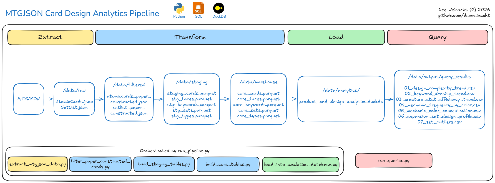

# Pipeline Architecture

## Overview
This project uses a layered local analytics pipeline to transform raw MTGJSON source data into business-facing analytical outputs. The workflow moves from raw ingestion and scope filtering to normalized staging tables, warehouse-layer feature modeling, DuckDB semantic views, and final analysis queries.

## Data Flow

1. Raw source ingestion into `data/raw`
2. Project-scope filtering into `data/filtered`
3. Normalized staging outputs in `data/staging`
4. Warehouse-layer analytical tables in `data/warehouse`
5. DuckDB semantic layer in `data/analytics`
6. Query results in `data/output/query_results`

See diagram for a visual overview of the project flow from raw source ingestion to final business query outputs:

## Data Folder Structure

- `data/raw/`        Original downloaded MTGJSON source files
- `data/filtered/`   Filtered source extracts restricted to paper-constructed scope
- `data/staging/`    Intermediate normalized datasets used during transformation
- `data/warehouse/`  Curated analytics-ready parquet outputs at stable business grains
- `data/analytics/`  DuckDB database used to expose the semantic and query layer
- `data/output/`     Final query result exports, previews, and execution metadata

## Architecture Justification

This pipeline separates source-preserving normalization from analytical feature modeling. That separation keeps early-stage transformations close to source truth while reserving derived metrics and business abstractions for warehouse tables and semantic views.

The structure also makes the project easier to review and maintain. Each layer has a clear responsibility, which improves traceability from source data to final business outputs.

## Naming Conventions

Naming conventions:
- `stg_*`: staging-layer datasets used for normalized intermediate transformations
- `core_*`: warehouse-layer datasets at stable analytical grain
- `core.*`: warehouse core tables loaded into DuckDB as parquet-backed views
- `analytics.*`: semantic views built on top of the warehouse layer
- numbered SQL files: view definitions, macros, and business queries stored in deterministic execution order

## Pipeline Orchestration

The data pipeline follows an Extract -> Transform -> Load -> Query sequence.

`run_pipeline.py` is the main orchestration entry point for the ETL workflow. It sequentially executes extraction, project-scope filtering, staging transformations, warehouse modeling, and DuckDB semantic-layer loading.

`run_queries.py` is executed separately to run the final business queries against the DuckDB semantic layer and export query results.

## Extract

`extract_mtgjson_data.py` establishes a reproducible raw-data foundation before project-specific filtering begins.

It downloads the MTGJSON AtomicCards and Sets datasets, verifies download integrity using the published SHA256 hashes, extracts the archives, and records source metadata for provenance and reproducibility.

Outputs to /data/raw

## Transform

### Scope Selection

`select_paper_constructed_cards.py` filters the AtomicCards dataset to include only cards relevant to paper-constructed formats.

Excludes cards that:
- are not legal in any supported paper format
- have non-playable layouts (tokens, planes, schemes, etc.)
- are marked as joke/unset cards

This step reduces the full dataset to the subset relevant for deckbuilding and gameplay analysis.

Outputs to /data/filtered

### Staging Normalization

`build_staging_tables.py` normalizes the curated JSON extracts into structured parquet-backed staging tables.

This layer flattens the nested AtomicCards structure into explicit tables representing cards, faces, keywords, types, and sets while preserving source fidelity for later modeling.

Outputs to /data/staging.

### Warehouse Modeling

`build_core_tables.py` derives warehouse-layer analytical features from staging outputs while preserving selected nested source attributes needed for downstream semantic modeling.

Canonical warehouse outputs are written as parquet, with preview CSVs included for quick inspection and QA.

Outputs to /data/warehouse

## Load

`load_into_analytics_database.py` initializes a local DuckDB analytics database, registers warehouse parquet outputs as core.* views, and builds business-facing analytics.* semantic views from version-controlled SQL files.

This layer provides a reusable analytical interface between the modeled warehouse tables and the final business queries.

Outputs to /data/analytics

## Query

`run_queries.py` executes version-controlled business queries against the DuckDB semantic layer.

These queries answer the project’s main product and design questions, export result tables to CSV, and write execution metadata for reproducibility and review.

Outputs to /data/output/query_results